# M4 — Exploratory Data Analytics Report

> **Project:** LZU INFO422 — Influencing Factors behind Video Game Sales
> **Group 23** | Week 7
> **Author:** Zhong Rui
> **Dataset:** `cleaned_vgchartz.csv` (8,786 records × 33 features)

---

## 1. Executive Summary

EDA of the VGChartz 2024 dataset investigates three research questions via 12 visualizations.

**Key findings:**
- Sales are extremely right-skewed (skewness = 8.04); `log_sales` reduces this to 2.55.
- Platform-genre interactions matter: Shooter×X360 and RPG×PS2 outperform.
- Regional preferences are distinct: Japan favors RPG, NA favors Shooter/Sports, PAL favors Racing.
- Critic score has weak correlation with sales (Spearman ρ ≈ 0.05).
- K-Means (K=4) isolates a blockbuster tier (2.7% of games, median 3.58M).
- Publisher brand effects operate through **scale** (volume) and **prestige** (per-game premium).

---

## 2. Data Overview

| Category | Columns | Count |
|----------|---------|:---:|
| Categorical | console (33), genre (20), publisher (551), developer | 4 |
| Core numerical | total_sales, critic_score, 4 regional sales | 6 |
| Temporal | release_date, release_year, release_year_bin (5 eras) | 3 |
| Clustering | sales_cluster (K=4) | 1 |
| Derived target | log_sales = ln(1 + total_sales) | 1 |
| Brand proxies | publisher_game_count, developer_game_count | 2 |

**Data quality:** Core features have 0% missing values. `jp_sales` has 63.7% zeros (post-imputation), flagged via `has_regional_data`.

---

## 3. Univariate Analysis

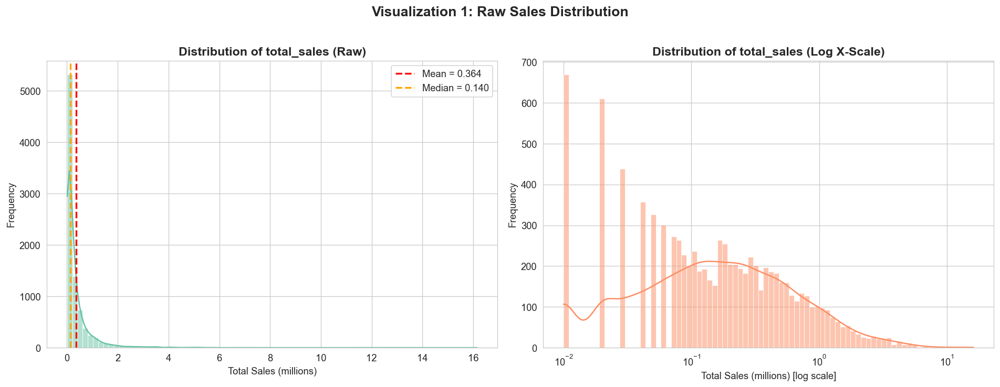

**Viz 1 — Raw `total_sales`:** Mean (0.364M) is 2.6× the median (0.140M); skewness = 8.04. Over 75% of games sell below 0.39M; maximum = 16.15M. The log-scale view confirms sales span multiple orders of magnitude.

> **Takeaway:** `log_sales` should be the modelling target to avoid outlier domination.

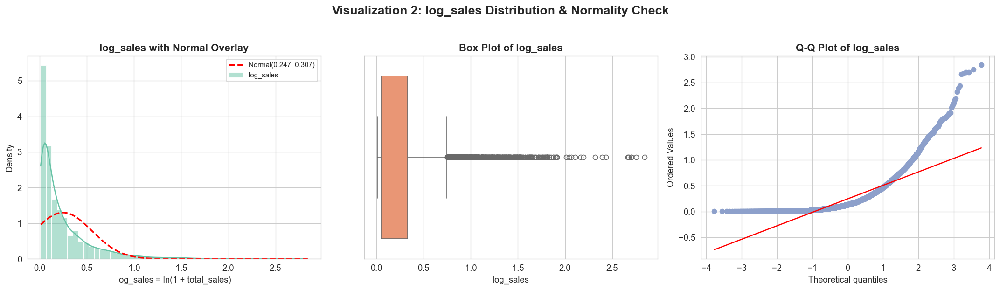

**Viz 2 — `log_sales`:** Skewness drops 68% (8.04 → 2.55). Q-Q plot shows good linearity in the central 95%. Shapiro-Wilk rejects exact normality, but the distribution is well-behaved for parametric methods.

> **Takeaway:** `log_sales` is a viable regression target.

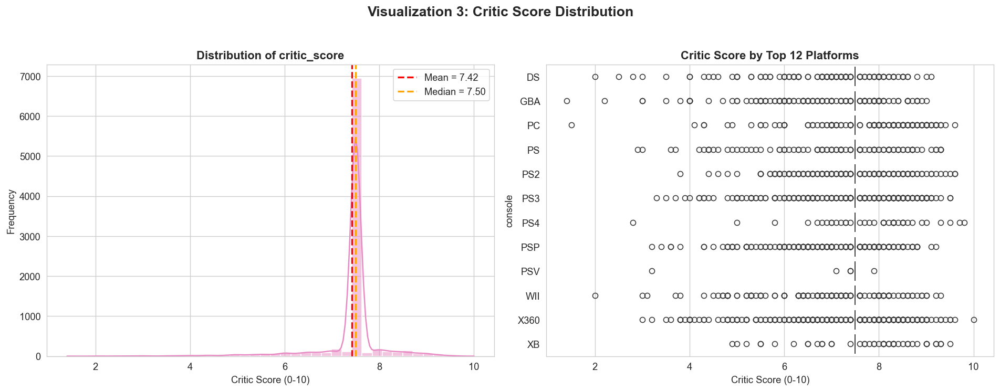

**Viz 3 — `critic_score`:** Mean = 7.42, median = 7.50. A spike at 7.50 reflects median imputation of ~2,300 missing scores. Platform medians all cluster near 7.5, suggesting review aggregation normalizes scores across the industry.

> **Takeaway:** `critic_score` has limited variance and an imputation artifact; not a strong standalone predictor.

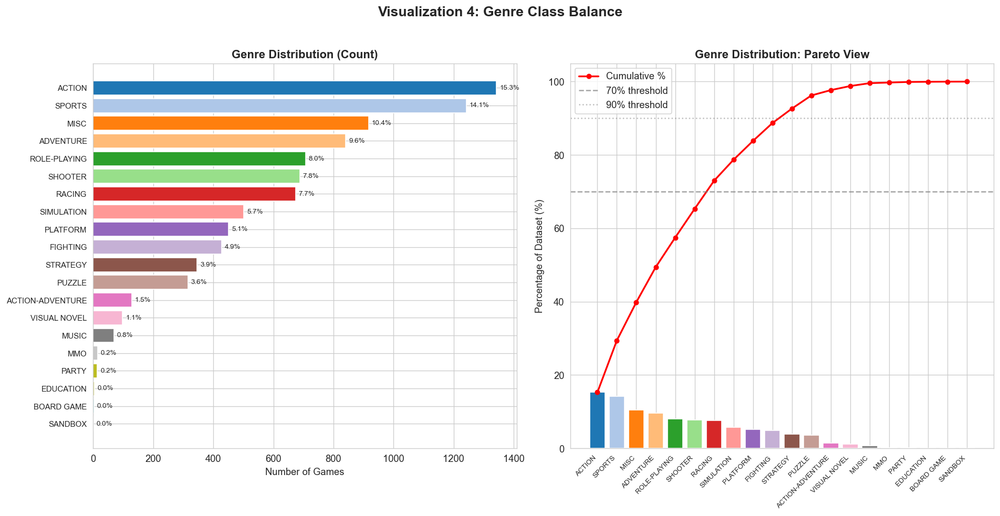

**Viz 4 — Genre balance:** Top 3 genres (ACTION 15.3%, SPORTS 14.1%, MISC 10.4%) = 39.8%. Top 7 = 70.7%. Tail includes SANDBOX (1), BOARD GAME (2), EDUCATION (2).

> **Takeaway:** Rare genres (<1%) should be aggregated as "Other" in per-genre analyses.

---

## 4. Bivariate Analysis

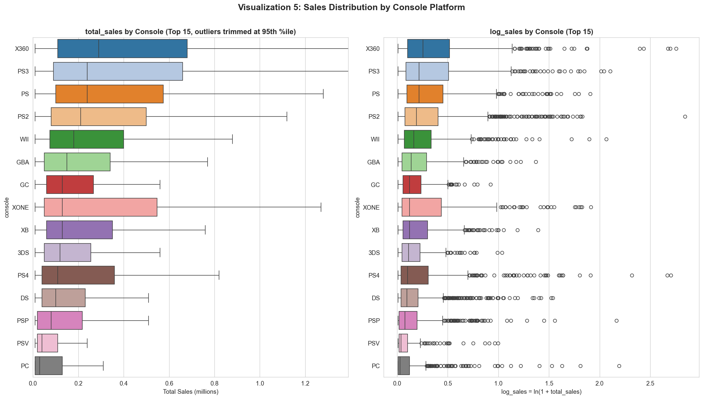

**Viz 5 — Sales by platform:** DS and PS2 lead in game count (~1,055 each). Median sales are uniform (0.05M–0.20M). Upper-tail differences matter: PS4, X360, and Wii show elevated outliers. PC has the lowest median, likely from undercounted digital distribution.

> **Takeaway:** Platform alone weakly differentiates median sales; the platform-genre interaction (Viz 8) is more informative.

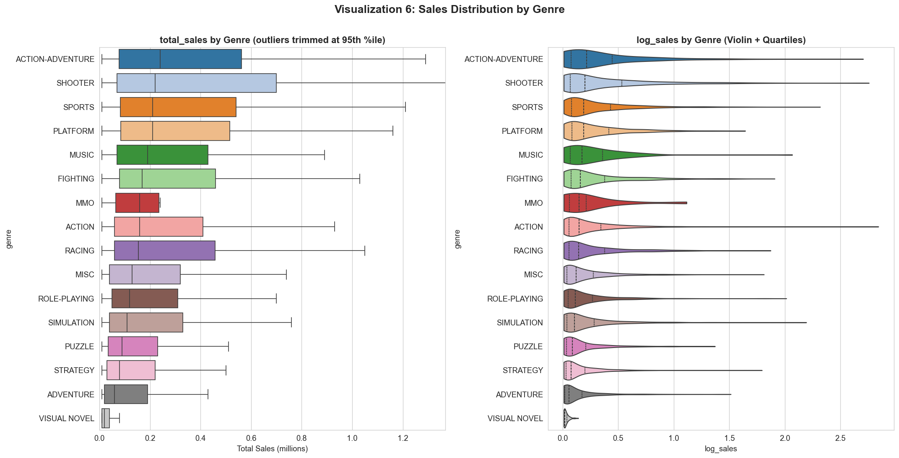

**Viz 6 — Sales by genre:** SHOOTER and ROLE-PLAYING have the highest medians and widest spread (blockbuster economics). SPORTS is compressed (annualized franchises). MISC is bimodal — a catch-all mixing niche and hits.

> **Takeaway:** Genre differentiates sales more strongly than platform. SHOOTER/RPG carry a premium; niche genres have a low ceiling.

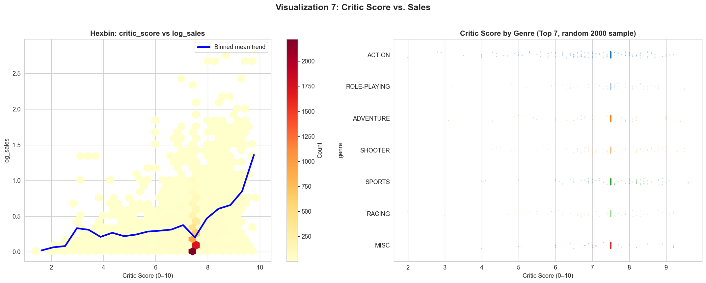

**Viz 7 — Critic score vs. sales:** Weak positive correlation (Pearson r ≈ 0.05, Spearman ρ ≈ 0.05). Sales spread at any given score is enormous — even perfect 10.0 scores span the full range.

> **Takeaway:** Critic score alone explains <0.5% of variance. Not a primary predictor.

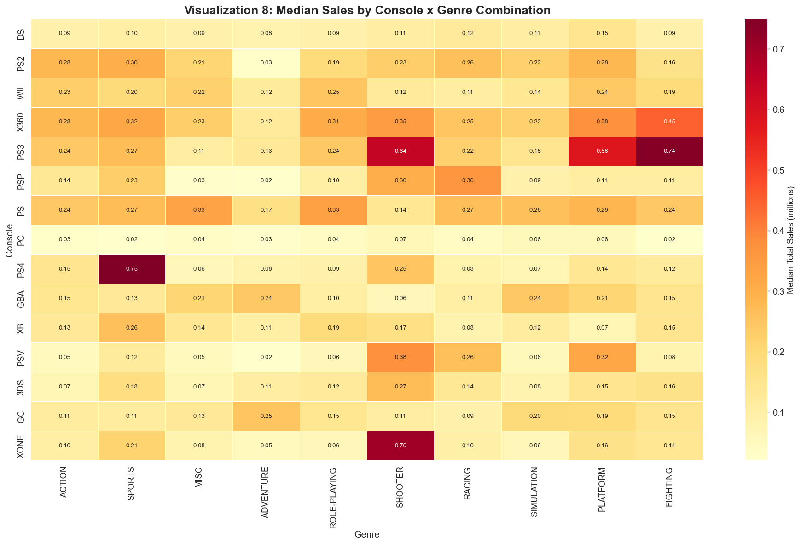

**Viz 8 — Console × genre heatmap:** Top combinations: PS4×SPORTS (0.75M), PS3×FIGHTING (0.74M), PS3×SHOOTER (0.64M), XONE×SHOOTER (0.70M). PC is consistently low (0.02–0.07M).

> **Takeaway:** Platform-genre interaction is meaningful. Include interaction terms for Q1 modelling.

---

## 5. Multivariate Analysis

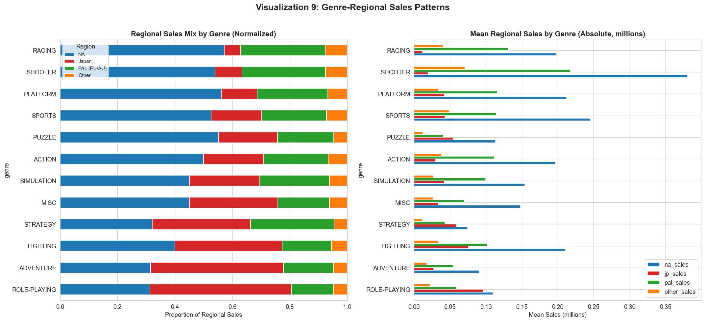

**Viz 9 — Regional patterns:** Three distinct clusters:

| Region | Dominant Genres | Key Pattern |
|--------|----------------|-------------|
| **NA** | SHOOTER, SPORTS, ACTION | na_ratio > 0.40 |
| **Japan** | RPG, VISUAL NOVEL, FIGHTING | jp_ratio > 0.35 for RPG |
| **PAL** | RACING, PLATFORM, SPORTS | Elevated pal_ratio |

NA dominates absolute volume, but proportional analysis reveals genuine cultural preferences.

> **Takeaway:** Regional ratios are viable inputs for region-specific models (Q2).

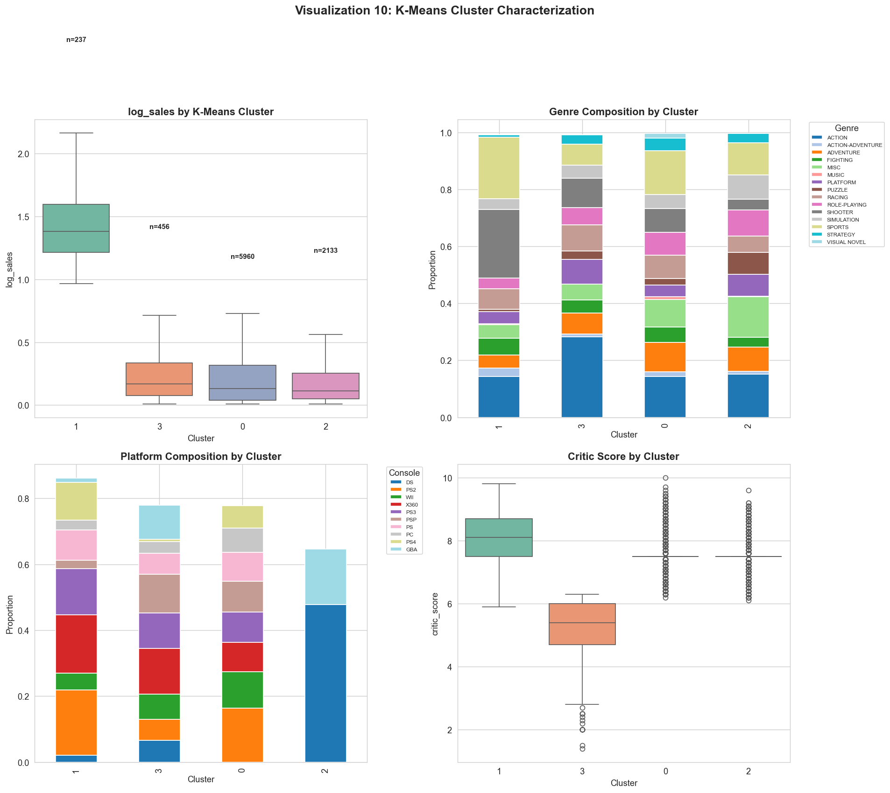

**Viz 10 — K-Means clusters (K=4):**

| Cluster | n | % | Median | Dominant Genres | Tier |
|:---:|:---:|:---:|:---:|:---|:---|
| 1 | 237 | 2.7% | 3.58M | ACTION, SHOOTER | Blockbuster |
| 0 | 5,960 | 67.8% | 0.29M | Balanced | Mainstream |
| 3 | 456 | 5.2% | 0.33M | SPORTS, RACING | Mid-tier |
| 2 | 2,133 | 24.3% | 0.24M | MISC, ADVENTURE | Budget/Niche |

Critic scores vary minimally across clusters (7.5–8.0).

> **Takeaway:** Enables a two-stage approach (classify tier → predict within-tier), addressing target imbalance.

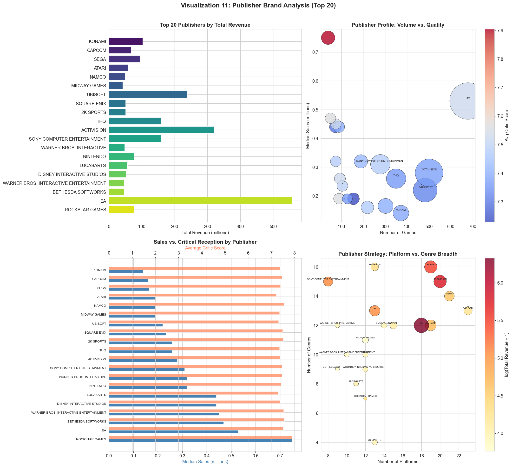

**Viz 11 — Publisher brand:** **Volume publishers** (EA, Ubisoft: many games, moderate per-title sales) vs. **prestige publishers** (Nintendo, Rockstar: fewer games, higher premium). Nintendo achieves both. Critical and commercial success are loosely coupled.

> **Takeaway:** Brand effect operates through scale (`publisher_game_count`) and prestige (publisher identity). Include both separately for Q3.

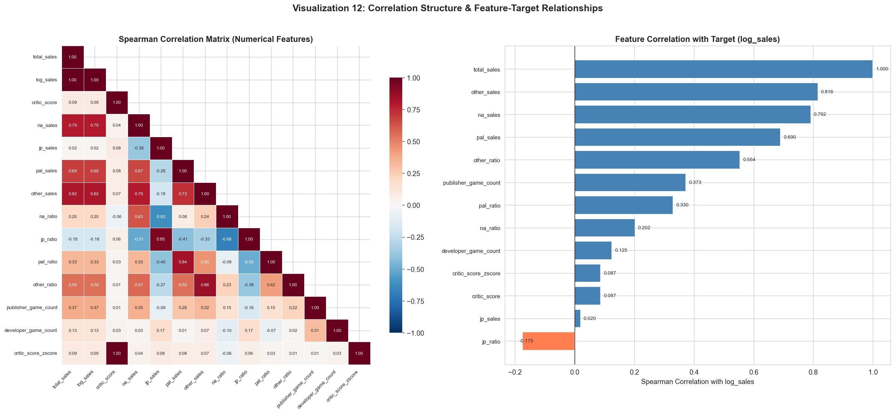

**Viz 12 — Correlation matrix:** Western regional sales are highly intercorrelated (ρ > 0.6). `jp_sales` is weaker (ρ ≈ 0.3–0.4), confirming Japan's distinctiveness. `publisher_game_count` and `developer_game_count` are highly correlated (ρ > 0.8) — only one should enter a model.

> **Takeaway:** Avoid data leakage (regional sales alongside `total_sales`). Japan-Western divergence justifies region-specific sub-models (Q2).

---

## 6. Revised Hypotheses

### Q1 — Platform-Genre Sales Advantage
**Original:** Total sales vary across platform-genre combinations.  
**Revised (supported):** The interaction is meaningful (Viz 5, 6, 8), concentrated in the upper quartile. SHOOTER/RPG carry a premium. Handhelds excel in niche genres. Later-gen consoles show higher per-game sales.

### Q2 — Genre-Regional Impact
**Original:** Genres impact sales differently across regions.  
**Revised (strongly supported):** Three clusters identified (Viz 9): NA→Shooter/Sports/Action; JP→RPG/Visual Novel/Fighting; PAL→Racing/Platform/Sports. Limitation: `jp_sales` has 63.7% zeros.

### Q3 — Brand Effect
**Original:** Brand significantly impacts sales.  
**Revised (supported):** Two mechanisms: (1) **scale** via `publisher_game_count`, (2) **prestige** via publisher identity. Model separately.

---

## 7. Modelling Question

> **"Can we predict a video game's global sales (`log_sales`) using platform, genre, publisher, critic score, and release era, and quantify each factor's relative importance?"**

| Component | Specification |
|-----------|--------------|
| **Target** | `log_sales` |
| **Features** | console, genre (one-hot), publisher, developer (target-encoded), critic_score, release_year_bin, sales_cluster |
| **Interactions** | Platform-genre term, regional ratios |
| **Brand proxies** | `publisher_game_count` OR `developer_game_count` |
| **Models** | Linear Regression → Random Forest → XGBoost |
| **Evaluation** | R², RMSE, MAE; 5-fold CV |
| **Validation** | Feature importance ranking for Q1–Q3 |

Q1: Random Forest feature importance. Q2: Regional ratios + stratified evaluation. Q3: Compare publisher identity vs. scale.

---

## Appendix: Visualization Inventory

| # | Type | Visualization | Addresses |
|:--:|------|---------------|:---:|
| 1 | Univariate | Sales distribution (raw + log) | — |
| 2 | Univariate | `log_sales` + QQ-Plot | — |
| 3 | Univariate | `critic_score` by platform | — |
| 4 | Univariate | Genre balance (Pareto) | — |
| 5 | Bivariate | Sales by console | Q1 |
| 6 | Bivariate | Sales by genre | Q1, Q2 |
| 7 | Bivariate | Critic score vs. sales | — |
| 8 | Bivariate | Console × genre heatmap | Q1 |
| 9 | Multivariate | Regional proportions | Q2 |
| 10 | Multivariate | K-Means clusters | Q1, Q3 |
| 11 | Multivariate | Publisher brand | Q3 |
| 12 | Multivariate | Correlation matrix | M5 |

**Total: 12 visualizations**

---

## References

- VGChartz 2024 Dataset: [Kaggle](https://www.kaggle.com/datasets/asaniczka/video-game-sales-2024)
- Full EDA code: `INFO422-DS Project-group-23-EDA.ipynb`
