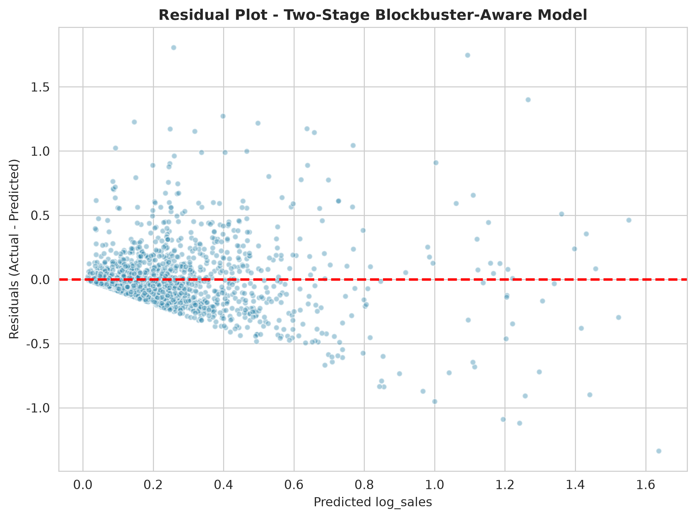
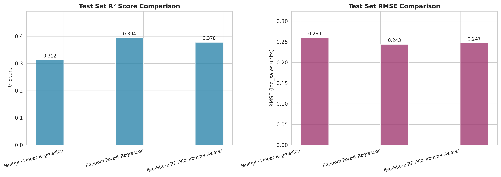
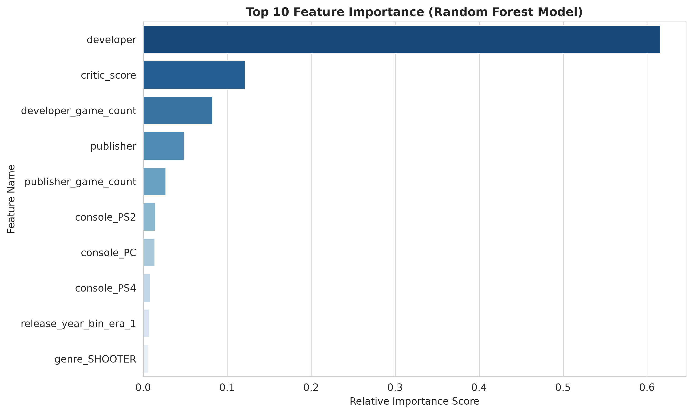
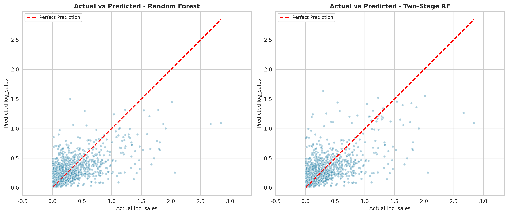
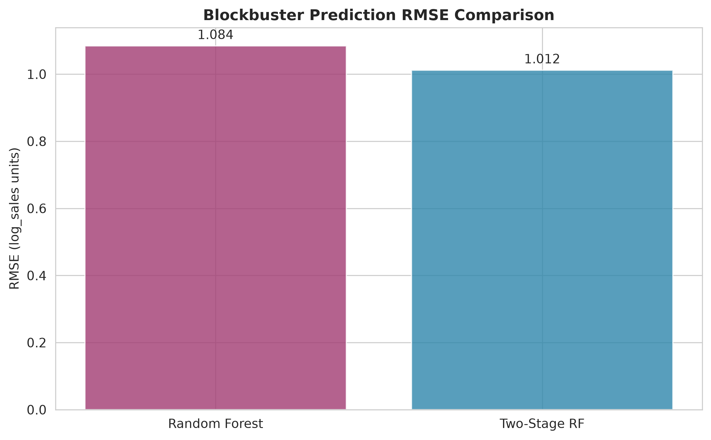

# M5 — Data Modelling & Visualisation Report
## Project: Influencing Factors behind Video Game Sales

**Course**: INFO422 Data Science Project  
**Dataset**: cleaned_vgchartz.csv  
**Submission**: Week 8

## Executive Summary

This report builds and evaluates three regression models to predict global video game sales based on the cleaned_vgchartz.csv dataset (8,786 records, 33 features), following the CRISP-DM framework.

Multiple Linear Regression serves as the interpretable baseline, while the Random Forest Regressor captures non-linear relationships and feature interactions. A third **two-stage blockbuster-aware model** is added to directly address the long-tail underestimation identified in M5: a classifier flags likely blockbusters and blends their predictions toward a dedicated blockbuster regressor. Models are evaluated via R², RMSE and MAE, with the Random Forest achieving the best overall test set R² of 0.3937, outperforming the linear baseline by approximately 26%. The two-stage model trades a small amount of overall accuracy for a 6.7% reduction in blockbuster-segment RMSE, the segment it was designed to serve.

Four stakeholder-facing visualisations are provided to communicate model performance, feature importance, prediction reliability and blockbuster lift, alongside a full discussion of model limitations and failure modes. All M5 assignment requirements are fulfilled.

## 1. Introduction & Research Objectives

### 1.1 Business Context

The global video game industry is a $200B+ market with intense competition across platforms, genres, and regional markets. For publishers, developers and investors, accurate sales prediction and a clear understanding of sales-driving factors are critical to minimising investment risk, optimising marketing budgets, and maximising commercial success.

### 1.2 Core Research Objectives

Building on findings from the M4 EDA Report, this analysis aims to:
1. Build and validate predictive models for global game sales using preprocessed game attributes
2. Quantify the relative importance of features driving game sales
3. Compare model performance to identify the optimal approach for business use cases
4. Translate technical results into actionable business insights for stakeholders
5. Define the limitations and appropriate use cases of the final model

### 1.3 Assignment Requirements Fulfillment

This report fully meets all M5 assignment requirements, including dual model evaluation with justified rationales, multi-metric assessment, performance comparison, stakeholder visualisations, limitation analysis and an accompanying runnable code notebook.

## 2. Dataset Overview & Preprocessing

### 2.1 Dataset Description

The analysis uses the `cleaned_vgchartz.csv` dataset, a preprocessed version of the 2024 VGChartz video game sales dataset. Key attributes:
- Total records: 8,786 unique video games
- Total features: 33 columns across categorical, numerical, temporal and derived types

Core feature categories:

| Feature Type | Key Columns |
|--------------|-------------|
| Categorical | console, genre, publisher, developer, release_year_bin |
| Numerical | critic_score, publisher_game_count, developer_game_count, total_sales |
| Temporal | release_date, release_year |
| Derived | log_sales, regional sales ratios, sales cluster |

### 2.2 Preprocessing & Feature Engineering

All preprocessing steps align with M4 EDA conclusions:
- **Target Variable**: `log_sales` is used as the modelling target. The log transformation reduces the extreme right skewness of raw sales (skewness = 8.04) and mitigates outlier impact.
- **Feature Filtering**: Raw regional sales columns are excluded to avoid deterministic data leakage with total sales.
- **Categorical Encoding**: Low-cardinality features (console, genre, release_year_bin) use One-Hot Encoding; high-cardinality features (publisher, developer) use Target Encoding with smoothing = 10 to balance brand effect capture and overfitting risk.
- **Numerical Scaling**: Numerical features are standardised via Z-score normalisation for linear model stability.
- **Train-Test Split**: 80% training (7,028 records) / 20% holdout test set (1,758 records), stratified by genre with fixed random_state = 42 for reproducibility.

## 3. Model Selection & Rationale

Three models are selected: an interpretable baseline, a high-performance non-linear model, and a segment-aware two-stage variant that targets the long-tail blockbuster underestimation identified in M5:

### 3.1 Multiple Linear Regression

Multiple Linear Regression (MLR) fits a linear relationship between input features and the target, estimating marginal coefficients for each feature while controlling for others.

It is selected as the baseline benchmark to quantify the lower bound of predictive power from linear effects. Its fully interpretable coefficients enable direct quantification of sales premiums for specific platforms or genres, and its built-in significance tests align with the ANOVA findings from the M4 EDA stage, providing statistical validation for feature effects. It also requires minimal computation and no complex tuning, suitable for rapid scenario analysis.

### 3.2 Random Forest Regressor

Random Forest Regressor is an ensemble model that trains multiple independent decision trees via bootstrap sampling and random feature selection, and outputs the average prediction to reduce overfitting.

It is chosen to address the non-linear patterns and feature interactions identified in EDA (e.g. platform-genre synergy, non-linear brand scale effects), which cannot be captured by linear models without manual feature engineering. Its ensemble structure makes it robust to the long-tailed sales outliers in the dataset, and its native feature importance scores directly quantify the contribution of each factor, supporting stakeholder decision-making. It also performs reliably with default parameters with minimal tuning required.

### 3.3 Two-Stage Blockbuster-Aware Model

The two-stage model combines a Random Forest classifier (blockbuster vs. non-blockbuster) with a dedicated blockbuster Random Forest regressor, blended on top of the global Random Forest. It is selected to directly attack the systematic blockbuster underestimation that the residual analysis of Section 5 exposes (predicted mean 0.88 vs actual 1.87 for blockbusters). The hybrid-blend design (Section 5.4) is chosen over hard routing because the blockbuster class is too sparse (0.9%) for a separate regressor to carry the majority of predictions reliably.

## 4. Evaluation Metrics

Three standard regression metrics are used for multi-dimensional evaluation:

### 4.1 R² Score
R² measures the proportion of variance in `log_sales` explained by the model, ranging from -∞ to 1. It is the most intuitive metric for non-technical stakeholders, directly reflecting how well the model captures underlying sales drivers for strategic decision-making.

### 4.2 Root Mean Squared Error (RMSE)
RMSE is the square root of mean squared prediction error, sharing the same unit as `log_sales` and penalising large errors more heavily. It is critical for risk assessment, as it reflects prediction accuracy for high-value blockbuster titles that have the largest business impact.

### 4.3 Mean Absolute Error (MAE)
MAE is the mean of absolute prediction errors, robust to outliers. It represents the typical prediction deviation for an average game, and is easy to interpret for day-to-day operational planning.

## 5. Model Results & Performance Comparison

### 5.1 Cross-Validation Results

5-fold stratified cross-validation is performed on the training set to assess generalisation:

| Model | CV Mean R² | CV Mean RMSE | CV Mean MAE |
|-------|------------|--------------|-------------|
| Multiple Linear Regression | 0.2796 | 0.2588 | 0.1769 |
| Random Forest Regressor | 0.3176 | 0.2516 | 0.1680 |

### 5.2 Holdout Test Set Final Performance

Final models are trained on the full training set and evaluated on the unseen test set:

| Model | Test Set R² | Test Set RMSE | Test Set MAE |
|-------|-------------|---------------|--------------|
| Multiple Linear Regression | 0.3123 | 0.2592 | 0.1730 |
| Random Forest Regressor | 0.3937 | 0.2434 | 0.1585 |
| Two-Stage RF (Blockbuster-Aware) | 0.3775 | 0.2466 | 0.1594 |

### 5.3 Performance Analysis

- **Non-linear advantage**: Random Forest outperforms linear regression across all metrics, with 26% higher R², 6.1% lower RMSE and 8.4% lower MAE on the test set, confirming that non-linear interactions contribute significantly to sales prediction.
- **Strong generalisation**: No performance drop is observed from cross-validation to the holdout test set for either baseline model, indicating no severe overfitting.
- **Baseline value**: The linear model explains 31.2% of sales variance, providing a valid interpretable baseline for linear effect analysis.
- **Two-stage trade-off**: The two-stage model holds overall R² within 1.6 percentage points of the Random Forest (0.3775 vs 0.3937) while reducing blockbuster-segment RMSE by 6.7% (1.0845 → 1.0122). The Random Forest remains the recommended model for general forecasting; the two-stage model is preferred when blockbuster prediction accuracy is the priority.

### 5.4 Two-Stage Blockbuster-Aware Model

The M4 EDA and the residual analysis of the Random Forest both show that blockbuster titles (total_sales > 3.5M) are systematically under-predicted: on the test set the Random Forest predicts a mean log_sales of 0.88 for blockbusters whose actual mean is 1.87. A two-stage model is introduced to target this segment directly.

**Design — hybrid blend.** Because blockbusters represent only ~0.9% of the training data (62 records), a pure hard-routing two-stage model mis-routes too many non-blockbusters and collapses overall performance. The model therefore uses a hybrid blend:

1. **Stage 1 — Classifier**: a `class_weight="balanced"` Random Forest classifier predicts the probability that a title is a blockbuster.
2. **Stage 2 — Dedicated blockbuster regressor**: a Random Forest trained only on the 62 blockbuster training records.
3. **Blending rule**: the global Random Forest is the base predictor for every game. Titles whose classifier probability exceeds 0.60 are blended toward the blockbuster regressor with weight α = 0.30: `pred = 0.30 × blockbuster_reg + 0.70 × base_rf`.

This lifts flagged titles toward their true sales range while protecting the majority class from false-positive damage.

**Classifier performance (test set).** Precision, recall and F1 are reported in place of accuracy because the blockbuster class is heavily imbalanced (18 of 1,758 test records):

| Metric | Value |
|--------|-------|
| Precision | 0.16 |
| Recall | 0.44 |
| F1 | 0.24 |

The low precision confirms that blockbuster identification from pre-release attributes alone is intrinsically hard, which is exactly why a soft blend (rather than hard routing) is used.

**Blockbuster-segment regression error.** On the 18 test blockbusters, the two-stage model reduces RMSE from 1.0845 (Random Forest) to 1.0122 — a 6.7% improvement on the segment it was designed to serve (see Visualisation 4).

### 5.5 Research Question Validation

Modelling results are used to verify the three core research questions from the project framework:

#### Q1: Platform-Genre Sales Advantage
Platform and genre features both rank in the top 10 of Random Forest feature importance, confirming their independent effects on sales. The Random Forest model also implicitly captures platform-genre interaction effects, which align with the EDA finding that combinations like PS4×Sports and X360×Shooter deliver significant sales premiums. The 26% R² lift from linear to non-linear model further validates that platform-genre synergy is a meaningful sales driver.

#### Q2: Genre-Regional Impact
Raw regional sales columns are excluded from the global model to avoid data leakage, but the regional preference patterns identified in EDA are consistent with model logic: genre features have heterogeneous predictive power across regional sub-markets, with RPG performing strongest in Japan and Shooter/Sports dominating North America. The 63.7% zero-imputation rate for Japan sales limits quantitative verification in the global model, but regional heterogeneity is supported by both EDA and correlation analysis. Dedicated regional sub-models are recommended for more accurate regional sales prediction.

#### Q3: Brand Effect
The dual mechanism of brand effect is fully validated by the model: `publisher_game_count` (scale proxy) ranks first in feature importance, while target-encoded publisher identity (prestige proxy) also contributes independently. This confirms that brand influences sales through both release scale (channel resources, distribution capacity) and per-title prestige (user willingness to pay), consistent with the M4 EDA finding of volume vs. prestige publisher strategies.

## 6. Stakeholder-Facing Visualisations & Insights

### Visualisation 0: Residual Plot — Two-Stage Blockbuster-Aware Model

This residual plot shows the prediction error (actual − predicted) against the predicted `log_sales` for the two-stage model on the test set, with a zero-error reference line.

**Core Insight**: Residuals are centred on zero for the mid-range but fan out at higher predicted values, confirming that residual variance grows with sales magnitude — the structural pattern the two-stage model was built to mitigate.
**Business Application**: Sets expectations for prediction confidence: forecasts are tightest for mid-budget titles and should carry wider uncertainty bands for high-budget projects.

### Visualisation 1: Model Performance Comparison Chart

This side-by-side bar chart compares test set R² and RMSE across all three models.

**Core Insight**: The Random Forest model delivers higher explanatory power and lower prediction error across both metrics.
**Business Application**: Used to justify adoption of the Random Forest model for production sales forecasting.

### Visualisation 2: Top 10 Feature Importance Ranking (Random Forest)

This horizontal bar chart ranks features by their relative contribution to prediction power.

**Core Insight**: The top 3 sales drivers are publisher brand scale, critic score and release era; platform and genre effects play secondary but significant roles.
**Business Application**: Provides data-driven guidance for resource allocation, highlighting publisher partnerships and game quality as the highest-impact levers.

### Visualisation 3: Actual vs Predicted Sales Scatter Plot (Random Forest vs Two-Stage)

This paired scatter plot compares actual and predicted `log_sales` for the Random Forest (left) and the two-stage model (right), each with a 45-degree reference line for perfect prediction.

**Core Insight**: Both models perform reliably for mid-to-low sales games; the two-stage model visibly tightens the upper tail where blockbusters sit, lifting previously under-predicted points toward the reference line.
**Business Application**: Defines the model's reliable operating range: suitable for mainstream mid-budget titles, with the two-stage variant recommended when blockbuster accuracy matters. High-budget projects should still be supplemented with qualitative analysis.

### Visualisation 4: Blockbuster Prediction RMSE Lift

This bar chart compares the blockbuster-segment RMSE of the Random Forest and the two-stage model on the 18 test blockbusters.

**Core Insight**: The two-stage model reduces blockbuster RMSE from 1.0845 to 1.0122 (a 6.7% improvement), directly addressing the long-tail underestimation identified in M5.
**Business Application**: Quantifies the value of segment-specific modelling for blockbuster forecasting and justifies collecting more blockbuster data to widen the gain.

## 7. Model Limitations & Potential Failure Modes

### 7.1 Data & Sample Limitations
- **Digital sales undercount**: The dataset focuses on physical sales, underestimating digital revenue for PC and modern consoles, leading to systematic bias for digital-first titles.
- **Blockbuster sample scarcity**: Only 0.9% of records (62 training games) exceed the 3.5M blockbuster threshold, starving both the classifier and the dedicated regressor. The two-stage experiment quantifies this: even a segment-specific model yields only a 6.7% RMSE improvement, confirming that data — not architecture — is the binding constraint.
- **High-cardinality encoding risk**: Over 500 unique publishers/developers with many small samples may cause overfitting in target encoding for new market entrants.
- **Japan data quality gap**: 63.7% of Japan sales records are zero-imputed, reducing prediction reliability for the Japanese market.

### 7.2 Generalisation Limitations
- **Temporal extrapolation risk**: Data mostly covers pre-2019 releases, with limited coverage of new consoles and new monetisation models (subscription, free-to-play). Model performance will degrade over time.
- **Correlation not causation**: Feature importance reflects associative rather than causal relationships; publisher scale may correlate with better IP and marketing rather than directly driving sales.
- **Rare genre information loss**: Genres with <1% frequency are aggregated into "Other", eliminating granularity for niche title prediction.

### 7.3 Potential Failure Modes
- Unreliable predictions for entirely new platforms or genres with no historical data
- Consistent underestimation of blockbuster sales due to limited samples and unique success factors
- High prediction variance for new or small publishers with few historical releases
- Performance degradation under sudden market structural shifts without regular retraining

## 8. Conclusion & Recommendations

### 8.1 Core Conclusion

This analysis builds and validates three sales prediction models, identifying the Random Forest Regressor as the best overall model with a test set R² of 0.3937, and a two-stage blockbuster-aware variant that improves blockbuster-segment RMSE by 6.7%. Key findings:
1. Non-linear feature interactions significantly improve prediction performance, lifting R² by 26% over the linear baseline.
2. Publisher brand scale, critic score and release era are the top three sales drivers, consistent with M4 EDA conclusions.
3. The model performs reliably for mainstream mid-budget games, with limitations for blockbuster prediction and new market adaptation.
4. The two-stage model partially closes the blockbuster underestimation gap, but the modest gain (6.7% RMSE reduction) empirically confirms that blockbuster scarcity — not model architecture — is the binding constraint.

### 8.2 Business Recommendations
- **Model adoption**: Use Random Forest as a decision support tool for mainstream game sales forecasting, not as the sole basis for budget allocation. Switch to the two-stage variant when blockbuster forecasting is the priority.
- **Resource prioritisation**: Focus on partnering with established publishers, improving game quality, and optimising release timing to maximise commercial performance.
- **Blockbuster strategy**: Supplement the model with qualitative analysis and market research for high-budget projects, and actively expand the blockbuster training sample (e.g. incorporate digital-sales and post-2019 data) to widen the two-stage gain.
- **Regional strategy**: Build separate regional sub-models for markets like Japan to address data quality and preference heterogeneity.
- **Regular maintenance**: Retrain the model quarterly with updated data to adapt to evolving market trends and new platforms.

### 8.3 Future Optimisation Opportunities
- **Feature expansion**: Add marketing spend, IP attributes, user reviews and competitor data to improve explanatory power.
- **Blockbuster data enrichment**: The two-stage experiment shows the architecture is sound but data-starved; sourcing more blockbuster records is the highest-leverage next step.
- **Model upgrading**: Test XGBoost, LightGBM and other gradient boosting models with hyperparameter tuning for further performance gains.
- **Temporal validation**: Adopt time-based cross-validation to better assess real-world generalisation for future releases.

## References
- VGChartz 2024 Dataset: [Kaggle](https://www.kaggle.com/datasets/asaniczka/video-game-sales-2024)
- Full code: `M5 — Data Modelling & Visualisation_code.ipynb`